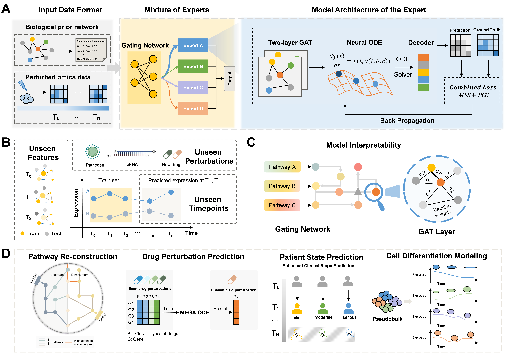

# MEGA-ODE

## MEGA-ODE: Learning Biologically Structured and Navigable Continuous Perturbation Dynamics from Sparse Omics.

<p align="center">
  
</p>

MEGA-ODE is a multi-level graph-based framework for generalizable and interpretable modeling of omics dynamics. It embeds prior biological knowledge by defining the ODE state space on a molecular interaction network parameterized by graph attention networks, and uses a mixture-of-experts architecture to capture heterogeneous dynamic behaviors across perturbations, timepoints, and molecular programs.

## Citation
MEGA-ODE: Learning Biologically Structured and Navigable Continuous Perturbation Dynamics from Sparse Omics.
Yujia Xiang, Yongge Li, Chunyan Tian, Ruichu Gu, Fuchu He, Han Wen, Linhai Xie, Peijie Zhou

bioRxiv 2026.08.05.742921; doi: https://doi.org/10.64898/2026.08.05.742921

## Collaborators

- [Candlelight-XYJ](https://github.com/Candlelight-XYJ)
- [yonggeli66](https://github.com/yonggeli66)


## Highlights

- MoE-based GraphODE for modeling heterogeneous perturbation dynamics.
- Graph attention over prior biological networks for interpretable molecular interactions.
- Generalization across unseen perturbations, unseen timepoints, and unseen molecular features.
- Expert-level interpretation through gating scores and attention weights.
- Applications to pathway-level causal structure, drug perturbation response, disease-severity gene prioritization, and stem-cell differentiation programs.

## Installation

Clone the repository and install MEGA-ODE in editable mode:

```bash
git clone https://github.com/Candlelight-XYJ/MEGA-ODE.git
cd MEGA-ODE
pip install -e .
```

A conda environment file is also provided:

```bash
conda env create -f environment.yml
conda activate megaode
pip install -e .
```

## Quick Start

Run the bundled demo with one function:

```python
from megaode import run_demo

result = run_demo("demo_data/")
```

Use the model API directly:

```python
from megaode import MEGAODE, load_demo_data

data = load_demo_data("demo_data/")
model = MEGAODE(
    in_feats=data.num_features,
    hidden_size=64,
    num_experts=4,
    out_feats=data.num_features,
    time_tick_num=5,
    gate_hidden_dim=32,
    ode_function="gat",  # default; use "mlp" for the original baseline
)

model.fit(data, epochs=100, lr=1e-3)
pred = model.predict(data, input_key="x36", output_index=3)
```

The ODE vector field can be selected through the Python API or demo CLI:

```bash
megaode-demo --ode-function gat
megaode-demo --ode-function mlp
```

`gat` is the default. The GAT vector field reuses each input graph's pre-built
PyG `edge_index`; `mlp` retains the original graph-independent ODE function.
